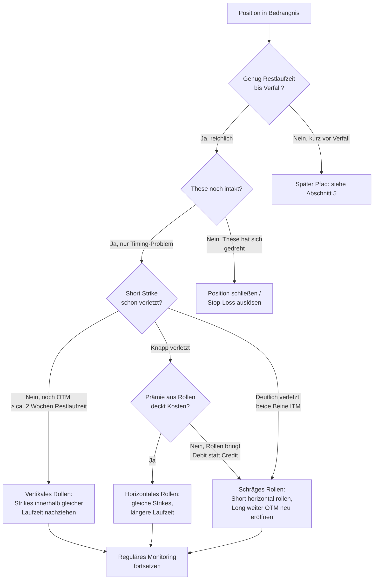

# Options-Doktor — Reparatur-Entscheidungsbaum für Credit Spreads

**Quelle:** Konzeptionell abgeleitet aus Friedenheim, "Optionen handeln mit Köpfchen",
Kap. 9 ("Reparaturen und Rollen bei Credit Spreads") — in eigenen Worten
strukturiert und auf UIQ-Format übertragen, keine Textübernahme.

**Status:** Konzeptentwurf, noch nicht implementiert. Ergänzt die bereits
bestehende `rollRules`-Lücke in `csp_wheel` (bewusst unverdrahtet gelassen,
17.08.2026-Entscheidung — genau dafür war der Options-Doktor als eigenes
Modul vorgesehen).

**Scope-Hinweis:** Das Original-Kapitel behandelt Credit Spreads (Bull Put /
Bear Call). Die Grundlogik (Stillhalter-Position gerät in Bedrängnis → Zeit
kaufen vs. Verlust begrenzen vs. Positionsstruktur ändern) lässt sich
analog auf CSP/Wheel übertragen, wo der Short Put die verwundbare
Komponente ist und kein Long-Bein zur Absicherung existiert — an den
Stellen, wo das Original einen "Long" referenziert, entfällt dieser Teil
bei einem reinen CSP.

---

## 1. Vorprüfung — vor jeder Reparaturentscheidung

Bevor irgendeine Reparaturstrategie gewählt wird, immer zuerst:

1. **Ist die ursprüngliche Richtungs-These noch intakt?** (Hat sich die
   fundamentale/technische Einschätzung des Basiswerts geändert, oder ist
   die aktuelle Kursbewegung nur kurzfristiges Rauschen?)
2. **Wie viel Restlaufzeit ist noch vorhanden?**
3. **Ist der Short Strike bereits verletzt (ITM), oder nur bedroht (nah am
   Geld, aber noch OTM)?**

Diese drei Antworten bestimmen, welcher Ast im Baum überhaupt infrage kommt.

---

## 2. Entscheidungsbaum



*(Mermaid-Diagramm — falls hier nicht gerendert, siehe Baumstruktur in
Abschnitt 3 als Text-Fallback.)*

---

## 3. Die einzelnen Reparatur-Pfade (Textform)

### 3.1 Abwarten
**Trigger:** Genug Restlaufzeit vorhanden, keine der unten genannten
Schwellen erreicht.
**Aktion:** Nichts tun. Kein Rollen, kein Stop.
**Voraussetzung:** Nur sinnvoll, wenn vorher keine expliziten
Stop-Kriterien definiert wurden (sonst inkonsistent mit dem eigenen Plan).

### 3.2 Stop-Loss für den kompletten Spread
**Trigger:** Vorab festgelegte Schwelle erreicht — entweder am Kurs des
Basiswerts (z. B. am Short Strike) oder am Wert des gesamten Spreads.
**Aktion:** Position glattstellen, Verlust realisieren.
**Bekanntes Risiko:** Slippage bei Gaps/schnellen Kursrutschen — die Order
kann zu einem schlechteren Kurs als der Trigger-Schwelle ausgeführt werden.

### 3.3 Komplettes Rollen
**Trigger:** These weiterhin intakt, aber mehr Zeit nötig; Position ist
grundsätzlich noch ordentlich strukturiert.
**Aktion:** Short zurückkaufen, alten Long verkaufen, beide Beine mit
längerer Laufzeit neu eröffnen.

### 3.4 Horizontales Rollen ("Standardmethode")
**Trigger:** Spread noch OTM, gleiche Strikes werden weiterhin für sinnvoll
gehalten.
**Aktion:** Gleiche Strikes, nur längere Laufzeit (üblich: 1–2 Monate).
**Bedingung für Sinnhaftigkeit:** Die Prämie des neuen (länger laufenden)
Short-Beins muss die Kosten des neuen Long-Beins mindestens decken —
sonst siehe 3.5.

### 3.5 Schräges Rollen (Diagonal)
**Trigger:** Horizontales Rollen (3.4) würde zu wenig Prämie einbringen,
um die Kosten zu decken.
**Aktion:** Alten Spread schließen, neuen Spread mit längerer Laufzeit UND
weiter aus dem Geld liegenden Strikes eröffnen.
**Ziel:** Trotz schwierigerer Ausgangslage noch einen Credit statt Debit
erzielen.

### 3.6 Vertikales Rollen
**Trigger:** Short Strike noch NICHT erreicht, UND mindestens ca. 2 Wochen
Restlaufzeit vorhanden (Faustregel aus dem Original, keine harte Grenze).
**Aktion:** Beide Strikes innerhalb der ursprünglichen Laufzeit nach oben
(Call-Spread) bzw. unten (Put-Spread) verschieben, um der Kursbewegung zu
folgen.

### 3.7 Stop Buy/Sell auf den Basiswert (nur bei echtem Spread mit Long-Bein)
**Trigger:** Bereits beim Aufsetzen des Trades vorbereitet — Stop-Order auf
den Basiswert exakt am Short Strike.
**Aktion bei Auslösung:** Position wandelt sich automatisch in einen
Covered Call/Covered Put (Basiswert wird bei Erreichen des Short Strikes
gekauft/leerverkauft). Der Long wird dadurch als Absicherung entbehrlich
und kann mit Gewinn verkauft oder bei fortbestehender Markterwartung
weitergehalten werden.
**Wichtige Folge-Regel ("Reparatur der Reparatur"):** Sobald diese
Stop-Order ausgelöst hat, sofort eine gegenläufige Stop-Order am selben
Strike setzen — sonst bleibt die neu entstandene Position im Basiswert
ungesichert.
**Bekanntes Risiko:** Wie bei jedem Stop — Slippage bei Gaps.

### 3.8 Short schließen (zurückkaufen), Long halten
**Trigger:** Einfachere Alternative zu 3.7 — wenn die automatische
Stop-Kombination nicht gewünscht ist.
**Aktion:** Nur das Short-Bein per Stop-Loss (z. B. am Short Strike)
zurückkaufen, den Long behalten.
**Kompromiss:** Realisiert sofort einen Teilverlust auf das Short-Bein,
lässt aber Aufwärtspotenzial im Long offen — bei diesem Schritt geht der
ursprüngliche Spread-Charakter (begrenztes Risiko) verloren.

### 3.9 Short rollen, Long schräg weiter OTM rollen
**Trigger:** Spread ist bereits deutlich überlaufen (beide Beine ITM);
horizontales Rollen allein würde nicht genug Prämie bringen.
**Aktion:** Short horizontal rollen (Credit), alten Long mit Gewinn
verkaufen, neuen Long weiter OTM eröffnen (Debit) — Nettoeffekt soll
weiterhin ein Credit sein.
**Wichtige Einschränkung:** Erhöht Margin-Bedarf und maximales Risiko
gegenüber der ursprünglichen Spread-Struktur — nur vertretbar, wenn die
Richtungs-These weiterhin unverändert gilt.

### 3.10 Short ausüben lassen, Long verkaufen, in Covered-Strategie übergehen
**Trigger — alle drei müssen zutreffen:**
- Bereitschaft, den Basiswert grundsätzlich als Covered-Position zu halten
- Richtungs-These unverändert
- Short Strike nur knapp verletzt, nicht massiv überlaufen
**Aktion:** Ausübung zulassen (keine aktive Handlung nötig), Long-Bein vor
Ablauf noch mit Gewinn verkaufen, danach reguläre Covered-Call/Put-Führung
auf dem eingebuchten Basiswert.
**Wichtige Folgen:** Deutlich höhere Margin-Anforderung als beim Spread,
unbegrenztes (bzw. beim Put deutlich höheres) Risiko im Vergleich zur
Spread-Struktur — Depot muss das tragen können. Zeitliches Problem: Der
Verkauf des Long-Beins mit Gewinn ist nur vor Ablauf möglich, aber die
Ausübung selbst findet typischerweise erst nahe/am Ablauf statt — dieses
Timing-Fenster ist eng und sollte vorab durchdacht werden.
**Erweiterung:** Der Long kann statt Verkauf auch auf eine längere
Laufzeit gerollt werden — daraus entsteht strukturell ein Collar.

### 3.11 Short rollen, Long ausüben
**Trigger:** Spread komplett überlaufen, nahe am Verfall.
**Aktion:** Long-Bein ausüben (Basiswert dadurch ins Depot holen bzw.
leerverkaufen), Short-Bein separat rollen.

### 3.12 LEAPS-Variante
**Trigger:** Gleiche Situation wie 3.7/3.10, aber Wunsch, sich nicht
direkt im Basiswert zu engagieren.
**Aktion:** Absicherung über eine langlaufende Option (LEAPS) statt über
den Basiswert selbst abbilden.

---

## 4. Übergreifende Leitplanken (aus dem Fazit des Kapitels)

- **Keine dieser Strategien ist universell "die richtige"** — welche
  passt, hängt von der aktuellen Markteinschätzung, verfügbarer
  Restlaufzeit und individuellen Risikokriterien (CRV, Margin, maximales
  Risiko) ab.
- **Jede Reparatur setzt voraus, dass die ursprüngliche These neu bewertet
  wurde** — nicht jeder Trade ist reparierbar, und das ist normal.
- **Erfolg heißt nicht zwingend volles Gewinnziel** — Breakeven oder ein
  kleinerer Verlust als ursprünglich drohend ist bereits ein positives
  Ergebnis.
- Mehrere Pfade erhöhen Margin-Bedarf und/oder maximales Risiko gegenüber
  der ursprünglichen Spread-Struktur — das muss vor der Entscheidung
  bewusst sein, nicht erst danach auffallen.

---

## 5. Offene Punkte für die weitere Ausarbeitung

1. **Übertragung auf CSP/Wheel (kein Long-Bein vorhanden):** Pfade 3.7,
   3.8, 3.9, 3.10, 3.12 setzen ein Long-Bein voraus. Für reines CSP/Wheel
   bräuchte es eine vereinfachte Variante (z. B. nur 3.1/3.2/3.6/3.10-
   Analogon: "andienen lassen und in Covered Call übergehen" — das ist ja
   ohnehin das Wheel-Prinzip).
2. **Später Pfad (Knoten "L" im Diagramm):** Das Kapitel behandelt primär
   den Fall mit ausreichender Restlaufzeit. Verhalten bei sehr kurzer
   Restlaufzeit (wenige Tage) ist im Kapitel nur am Rand gestreift (3.11)
   — hier eigenständig nachschärfen.
3. **Keine harten Zahlenschwellen im Original** (außer der "≥ 2 Wochen"-
   Faustregel bei 3.6) — die übrigen Trigger sind qualitativ. Für eine
   KI-Prompt-Umsetzung braucht es eigene, UIQ-spezifische Schwellenwerte
   (z. B. "wie nah am Short Strike gilt als 'knapp verletzt'?").
4. **Rechtlicher Rahmen:** Genau wie bei den bestehenden Optionsstrategien
   müsste der Options-Doktor als reine Informationsdarstellung formuliert
   werden (§1 WpHG), keine konkrete Handlungsaufforderung — selbst im
   EIC-Modus vermutlich mit klarerer Kennzeichnung als "eine mögliche
   Betrachtungsweise", da hier eine bestehende Position und nicht nur eine
   Kandidatensuche betroffen ist.

---

## 6. Skizze für `ko-prompts.js` (Diskussionsgrundlage, nicht final)

```javascript
options_doktor: {
  lbKey: null,  // kein Leaderboard — braucht Positions-Input, kein Scan
  hint: '🩺 Options-Doktor: Reparatur-/Roll-Entscheidung für bestehende Credit-Spread- oder CSP-Position',
  color: '#e11d48',
  // Erwartet zusätzlichen Kontext ggü. den anderen Strategien:
  // ctx.position = { typ: 'put_credit_spread'|'call_credit_spread'|'csp',
  //                   shortStrike, longStrike (falls Spread), verfall,
  //                   aktuellerKurs, urspruenglicheThese (Freitext) }
  prompt: function(ctx) {
    var p = ctx.position || {};
    return KI_ANTI_HALLUZINATION
      + '⚠️ Diese Analyse dient ausschliesslich zu Informationszwecken gem. §1 WpHG. '
      + 'Keine Handlungsaufforderung — Darstellung möglicher Betrachtungsweisen für eine '
      + 'bereits bestehende Position, die Entscheidung liegt beim Trader.\n\n'
      + 'Du bist ein erfahrener Options-Trader, der eine bestehende Position bewertet, '
      + 'die durch eine Kursbewegung unter Druck geraten ist (Credit Spread oder CSP).\n\n'
      + 'POSITION:\n' + JSON.stringify(p, null, 2) + '\n\n'
      + ctx.marktkontext
      + '\n\nVORPRÜFUNG (immer zuerst beantworten):\n'
      + '1. Spricht die aktuelle Marktlage/Datenlage noch für die ursprüngliche These?\n'
      + '2. Wie viel Restlaufzeit ist noch vorhanden?\n'
      + '3. Ist der kritische Strike bereits verletzt (ITM) oder nur bedroht (nah, aber OTM)?\n\n'
      + 'AUFGABE:\n'
      + '1. EINORDNUNG: Basierend auf der Vorprüfung — welche Kategorie von Reparaturpfad '
      + 'kommt grundsätzlich infrage (Abwarten / Zeit kaufen durch Rollen / Struktur ändern '
      + '/ Verlust begrenzen)?\n'
      + '2. KONKRETE OPTIONEN: 2-3 passende Pfade mit Vor-/Nachteilen, jeweils inkl. '
      + 'Auswirkung auf Margin und maximales Risiko im Vergleich zur aktuellen Position.\n'
      + '3. WICHTIGSTE EINSCHRÄNKUNG: Was müsste zutreffen, damit der am ehesten passende '
      + 'Pfad tatsächlich sinnvoll ist (z. B. unveränderte These)?\n'
      + '\nAntworte auf Deutsch. Keine erfundenen Prämien — nur mit den übergebenen Werten '
      + 'rechnen, fehlende Werte explizit als "N/A — in IBKR/CapTrader prüfen" kennzeichnen.';
  }
},
```

**Offene Fragen zur Config, bevor das umgesetzt wird:**
- Woher kommen die Positionsdaten? Manuelle Eingabe (wie bisher bei
  Einzeltitel-Kontext) oder ein neues Eingabeformular im UI?
- Braucht es feste `focus`-Array-Einträge für den EIC-Modus wie bei den
  anderen 14 Strategien, oder ist der Public/Expert-Split hier anders zu
  gestalten, weil es sich um Positionsmanagement statt Kandidatensuche
  handelt?
